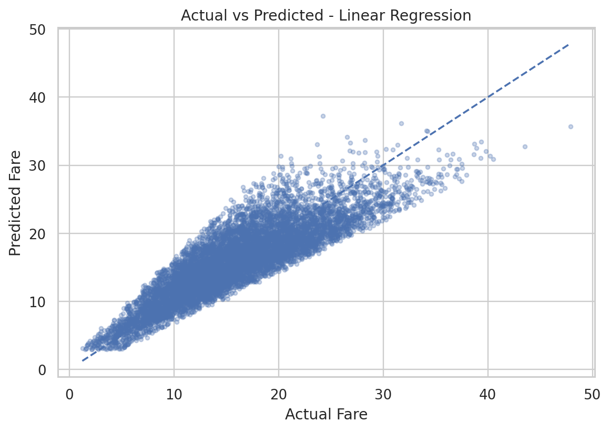
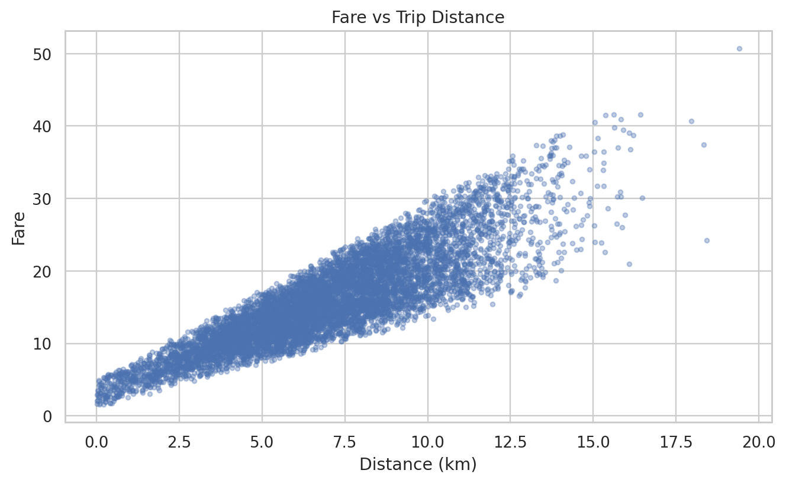
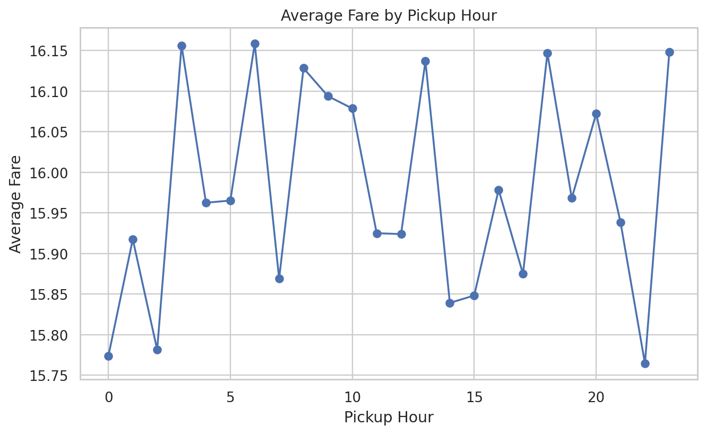

# 🚕 Uber Fare Prediction Model

  <strong>End-to-end machine learning project for Uber fare estimation</strong> 
  Data validation • Feature engineering • Model selection • Evaluation • Streamlit deployment

  
  
  
  

  <a href="https://uber-fare-prediction-model.streamlit.app/"><strong>🚀 Open Live Application</strong></a>
  &nbsp; • &nbsp;
  <a href="#-model-performance"><strong>📊 View Results</strong></a>
  &nbsp; • &nbsp;
  <a href="#-documentation"><strong>📚 Documentation</strong></a>

---

## 📌 Project at a Glance

| Item | Details |
|---|---|
| **Task** | Regression |
| **Target** | `fare_amount` |
| **Dataset** | 50,000 trip records |
| **Completed rides modeled** | 42,538 |
| **Models compared** | Linear Regression, Random Forest, Gradient Boosting |
| **Validation** | 5-fold cross-validation on training data |
| **Final evaluation** | 20% untouched holdout |
| **Selected model** | Linear Regression |
| **Holdout MAE** | **2.474** |
| **Holdout RMSE** | **3.093** |
| **Holdout R²** | **0.754** |
| **Deployment** | Streamlit |

## 🎯 Overview

This project builds an end-to-end regression pipeline for estimating trip fares from the supplied educational dataset.

The workflow covers:

- Data validation and cleaning
- Exploratory and business-focused analysis
- Time-based feature engineering
- Leakage-safe preprocessing
- 5-fold cross-validation
- Regression model comparison
- Untouched holdout evaluation
- Model serialization and reload validation
- Interactive Streamlit deployment
- Automated GitHub Actions validation

> **Scope:** All reported results are specific to the supplied educational 50,000-row dataset. They should not be interpreted as a description of Uber's real-world pricing system.

> **Important dataset note:** The supplied CSV does **not** contain `passenger_count`, although it is referenced in the assignment specification. Passenger-count analysis is therefore not performed, and no values are fabricated or inferred.

## 🚀 Live Application

**Try the deployed application:**

### 👉 [uber-fare-prediction-model.streamlit.app](https://uber-fare-prediction-model.streamlit.app/)

The Streamlit application provides:

| App section | What it does |
|---|---|
| **Predict Fare** | Estimates a fare for a new trip |
| **Business Dashboard** | Explores fares, distance, payment methods, cities and ride status |
| **Model Performance** | Displays model metrics, comparison results and predictions |
| **Data Quality** | Shows validation and coordinate-distance diagnostics |
| **About** | Explains methodology, scope and considerations |

## 📊 Model Performance

### Results at a glance

| Model | CV MAE | CV RMSE | CV R² |
|---|---:|---:|---:|
| **Linear Regression** | **2.4740** | **3.0868** | **0.7590** |
| Gradient Boosting | 2.4761 | 3.0911 | 0.7583 |
| Random Forest | 2.5272 | 3.1774 | 0.7447 |

**Selection criterion:** lowest mean 5-fold cross-validation RMSE on the training partition.

### Final untouched holdout

| Metric | Result |
|---|---:|
| **MAE** | **2.474** |
| **MSE** | **9.567** |
| **RMSE** | **3.093** |
| **R²** | **0.754** |

> R² is a regression metric, not percentage prediction accuracy. MAE and RMSE represent error in the dataset's fare units.

### Actual vs Predicted

### Fare vs Distance

### Average Fare by Hour

## 🔎 Key Findings

- `distance_km` has a strong positive Pearson correlation with fare of approximately **0.871** on valid completed rides.
- Haversine distance is used as a **diagnostic**, not a prediction feature, because it is inconsistent with the supplied `distance_km`.
- The correlation between Haversine distance and supplied `distance_km` is approximately **0.00069**; only about **1.50%** of rows are within 0.1 km.
- **06:00** has the highest average fare in the valid completed-ride data.
- Linear Regression has the lowest mean CV RMSE among the three evaluated models.
- The final selected pipeline achieves **0.754 R²** on the untouched holdout.
- Passenger-count effects cannot be evaluated because `passenger_count` is absent from the supplied dataset.

These are dataset-specific observations, not causal claims about Uber's production pricing.

## 🧠 Methodology

The project follows a leakage-aware training workflow:

~~~text
Raw Dataset
    ↓
Data Validation & Cleaning
    ↓
Completed Rides
    ↓
Feature Engineering
    ↓
80/20 Train–Holdout Split
    ↓
5-Fold Cross-Validation on Training Data
    ↓
Compare Linear Regression / Random Forest / Gradient Boosting
    ↓
Select Lowest Mean CV RMSE
    ↓
Fit Final Pipeline
    ↓
Evaluate Once on Untouched Holdout
    ↓
Serialize + Reload Model
    ↓
Streamlit Deployment
~~~

### Leakage prevention

- The holdout partition is not used for model selection.
- Preprocessing is contained inside the scikit-learn pipeline.
- Cross-validation fits transformations within each training fold.
- The selected pipeline is evaluated on the untouched holdout.
- The saved model is reloaded and checked for prediction consistency.

## 📚 Dataset

The supplied dataset contains **50,000 trip records**. After validation and cleaning:

- **49,997** rows remain valid.
- **42,538** completed rides are used for modeling.
- The target variable is `fare_amount`.

### Dataset dictionary

| Field / feature | Description | Project role |
|---|---|---|
| `key` | Trip identifier | Excluded from modeling |
| `fare_amount` | Recorded trip fare | **Target** |
| `pickup_datetime` | Pickup date and time | Source for time features |
| `pickup_longitude` / `pickup_latitude` | Pickup coordinates | Validation / Haversine diagnostic |
| `dropoff_longitude` / `dropoff_latitude` | Drop-off coordinates | Validation / Haversine diagnostic |
| `city` | City/category | Model feature |
| `payment_method` | Payment method/category | Model feature |
| `distance_km` | Supplied trip distance | **Model feature** |
| `pickup_year` | Pickup year | Engineered feature |
| `pickup_month` | Pickup month | Engineered feature |
| `pickup_day` | Pickup day | Engineered feature |
| `pickup_hour` | Pickup hour | Engineered feature |
| `day_of_week` | Day of week | Engineered feature |
| `is_weekend` | Weekend indicator | Engineered feature |
| `is_rush_hour` | Rush-hour indicator | Engineered feature |

### Passenger count limitation

The assignment references `passenger_count`, but the supplied 50K CSV does not contain that field. The project therefore does **not** fabricate, infer, or randomly generate passenger counts.

## 🤖 Prediction Features

The final model uses:

~~~text
city
payment_method
distance_km
pickup_year
pickup_month
pickup_day
pickup_hour
day_of_week
is_weekend
is_rush_hour
~~~

The model excludes identifiers, the target, passenger count, coordinate fields, and other information not supported by the final prediction contract.

## 📁 Repository Structure

~~~text
Uber-Fare-Prediction-Model/
│
├── app/                    # Streamlit application
├── dataset/                # Raw and cleaned datasets
├── models/                 # Trained model and evaluation outputs
├── notebooks/              # EDA and analysis
├── images/charts/          # README and analysis visuals
├── doc/                    # Detailed documentation
├── .github/workflows/      # Continuous integration
│
├── train.py                # Reproducible model-training pipeline
├── requirements.txt        # Runtime dependencies
├── requirements-notebook.txt
└── README.md
~~~

## 💻 Run Locally

### 1. Clone

~~~bash
git clone https://github.com/mightyalok00/Uber-Fare-Prediction-Model.git
cd Uber-Fare-Prediction-Model
~~~

### 2. Create a virtual environment

**Windows**

~~~powershell
py -m venv .venv
.\.venv\Scripts\python.exe -m pip install --upgrade pip
~~~

**macOS / Linux**

~~~bash
python3 -m venv .venv
source .venv/bin/activate
python -m pip install --upgrade pip
~~~

### 3. Install dependencies

~~~bash
pip install -r requirements.txt
~~~

### 4. Launch the application

~~~bash
python -m streamlit run app/app.py
~~~

## 🏋️ Reproduce Training

The authoritative training environment is **Python 3.12**.

~~~bash
python train.py --output-dir work/run_001
~~~

The training pipeline exports:

- `uber_fare_model.pkl`
- `model_metadata.json`
- `cross_validation_results.csv`
- `model_comparison.csv`
- `final_test_metrics.csv`
- `example_input.csv`
- `example_prediction.json`

The exported model is reloaded after serialization and checked for prediction consistency.

## 🤖 Continuous Integration

GitHub Actions validates the project in two paths:

**Python 3.12**
- Compiles the project
- Installs runtime dependencies
- Retrains the model
- Reloads the exported model
- Verifies a finite prediction

**Python 3.14.7**
- Compiles the source
- Loads the committed Python 3.12-trained model
- Verifies prediction compatibility
- Runs a Streamlit smoke test

CI does not modify or commit repository files.

## 🎯 Scope & Considerations

This project is designed as an educational and portfolio demonstration of an end-to-end machine learning workflow. The following points define the scope of the analysis and how the results should be interpreted:

- **Dataset scope:** Results are based on the supplied 50,000-row educational dataset and may not represent Uber's production pricing system.
- **Feature availability:** The supplied dataset does not contain `passenger_count`, so passenger-count effects cannot be evaluated.
- **Distance consistency:** Coordinate-derived Haversine distance differs substantially from the supplied `distance_km`; therefore, the supplied distance field is used for modeling while Haversine distance is retained as a diagnostic.
- **Prediction inputs:** The deployed model relies on features available in the project's prediction contract, including distance, location category, payment method, and time-based features.
- **Unobserved factors:** Real-world fares can be affected by variables such as surge pricing, traffic, tolls, ride category, demand, weather, and other operational factors that are not represented in this dataset.
- **Model interpretation:** Reported MAE, RMSE, and R² describe performance on the project's holdout data and should not be interpreted as guaranteed real-world fare accuracy.
- **Responsible use:** The project demonstrates the methodology and engineering process rather than reproducing Uber's proprietary pricing algorithm.

## 📚 Documentation

For deeper project details:

- [Assignment coverage](doc/ASSIGNMENT_COVERAGE.md)
- [Passenger-count note](doc/PASSENGER_COUNT_NOTE.txt)
- [Project documentation](doc/README.md)
- [EDA and analysis notebook](notebooks/Uber_Fare_Prediction.ipynb)
- [Model comparison results](models/model_comparison.csv)
- [Cross-validation results](models/cross_validation_results.csv)
- [Final holdout metrics](models/final_test_metrics.csv)
- [Model metadata](models/model_metadata.json)

## 👤 Author

**Alok Agarwal**

Data Analytics • Data Science • Machine Learning • Digital Marketing

  <a href="https://uber-fare-prediction-model.streamlit.app/"><strong>🚀 Try the Live Demo</strong></a>
  &nbsp; • &nbsp;
  <a href="https://github.com/mightyalok00/Uber-Fare-Prediction-Model"><strong>⭐ View the Repository</strong></a>

---

  Built as an educational machine-learning project with reproducibility, evaluation and deployment in mind.

